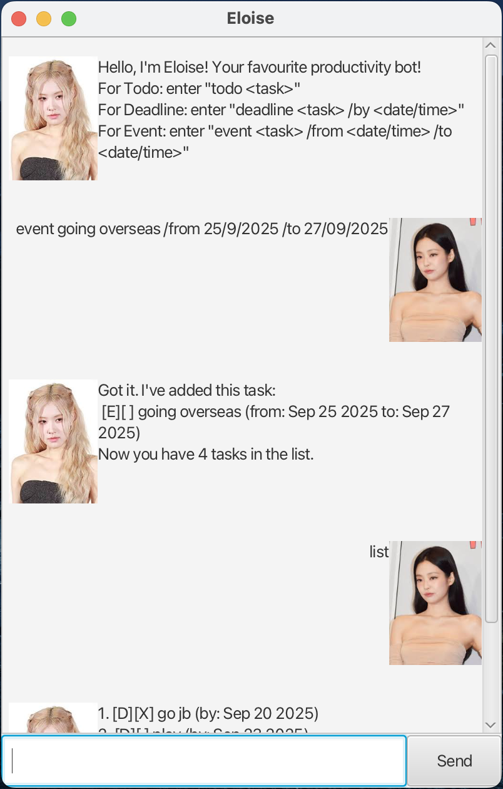

# Eloise User Guide

Eloise is a **personal task manager chatbot**.
It helps you keep track of todos, deadlines, and events in a conversational way.



## Features ✨

- **Task Management**
- **Deadlines & Events**
- **GUI Support**
- **Persistence**


### Adding a Task

Use keywords such as 'todo', 'deadline' and 'event' to add your tasks!

Example: `deadline <your task> /by dd/MM/yyyy HHmm`

```
[D][ ] <your task> (by: dd/MM/yyyy HHmm)
```

### Check your task off

Use 'mark' or 'unmark' to check your tasks off after you're done!

Example: `mark <task index>`

```
[D][X] <your task> (by: dd/MM/yyyy HHmm)
```

### Find your tasks 

Use 'find' to find specific tasks!

Example: `find book`

```
1. [D][ ] return book (by: dd/MM/yyyy HHmm)
2. [D][ ] borrow book (by: dd/MM/yyyy HHmm)
```

### List and Sort your tasks

Use 'list' to look at all your current tasks,
and 'sort' to sort them into alphabetical 
or chronological order (using 'sort date')

Example: `list`

```
1. [D][ ] write book (by: dd/MM/yyyy HHmm)
2. [T][ ] play games
```

Example: `sort`

```
1. [T][ ] play games
2. [D][ ] write book (by: dd/MM/yyyy HHmm)
```


## Getting Started 🚀

1. Download the latest release from the [releases page](https://github.com/jing-xiang-choong/eloise/releases).
2. Run the JAR file:
   ```bash
   java -jar eloise.jar